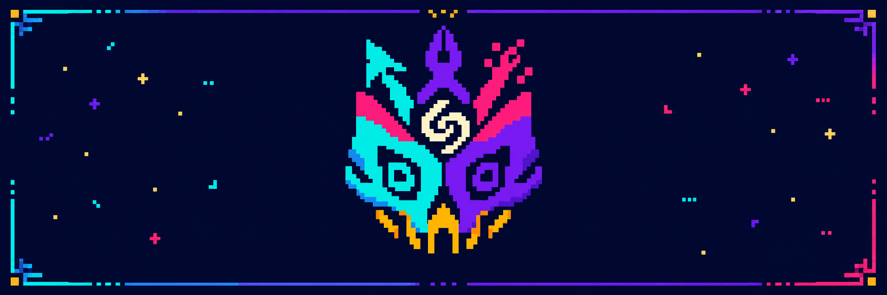

<p align="center">
  
</p>

<h1 align="center">DESIGN LAGANN</h1>

<p align="center">
  <strong>Break through generic UI.</strong><br />
  A cross-host design agent that plans, art-directs, builds, animates, and verifies distinctive interfaces.
</p>

<p align="center">
  <code>v1.0.0</code> · <code>Codex</code> · <code>Claude Code</code> · <code>Cursor</code> · <code>Apache-2.0</code>
</p>

<p align="center">
  <a href="#install">Install</a> ·
  <a href="#why-design-lagann">Why</a> ·
  <a href="#the-system">System</a> ·
  <a href="#host-support">Hosts</a> ·
  <a href="#contributing">Contribute</a> ·
  <a href="#sponsor-the-breakthrough">Sponsor</a>
</p>

> [!IMPORTANT]
> Design Lagann is not a theme, component pack, or prompt collection. It is a plan-first workflow that discovers references, protects approved work, makes intentional design decisions, implements complete states, and proves the rendered result.

## Install

One command. Three hosts.

| Target | Command |
| --- | --- |
| Codex | `npx design-lagann install --target codex` |
| Claude Code | `npx design-lagann install --target claude` |
| Cursor | `npx design-lagann install --target cursor` |
| Everywhere | `npx design-lagann install --target all` |

The installer writes the portable `design-lagann` Agent Skill to the selected host. Existing installations are never replaced silently: use `--dry-run` to preview destinations and `--force` to create a timestamped backup before updating.

Then ask naturally:

```text
Create a memorable airline booking landing page in Quality mode.
Redesign this dashboard, but preserve its navigation and data model.
Repair the mobile overflow without changing the approved desktop direction.
Add motion that explains hierarchy and state—not decoration.
```

## Why Design Lagann

Most AI design loops optimize the screenshot. Design Lagann optimizes the product decision.

| The common loop | Design Lagann |
| --- | --- |
| Pick a style and start coding | Establish one product-specific thesis first |
| Ask the user to collect inspiration | Search or generate qualified references itself |
| Rebuild the whole page | Inspect first and preserve approved work |
| Fill empty space with effects | Give every asset a content or composition role |
| Add one generic reveal class | Choreograph entrances, transitions, states, and reduced motion |
| Judge one polished viewport | Verify desktop, tablet, mobile, interactions, and accessibility |
| Keep iterating because it can | Stop on proof, no meaningful change, or a bounded pass limit |

The result is not merely “clean.” It is authored, responsive, functional, and defensible.

## The system

```text
request
  └─ classify: create · redesign · edit · extend · repair · transform
      └─ inspect + protect approved work
          └─ acquire references: search · generate · hybrid
              └─ define thesis + information architecture
                  └─ route type + assets + motion + product states
                      └─ implement the signature relationship
                          └─ capture desktop · tablet · mobile
                              └─ critique → repair → verify → stop
```

### The six operations

| Operation | Responsibility |
| --- | --- |
| `create` | Build a new experience from product truth |
| `redesign` | Replace or substantially evolve the visual system |
| `edit` | Change the smallest coherent existing part |
| `extend` | Add a page, section, state, or capability without losing direction |
| `repair` | Correct a defect while preserving intended behavior and appearance |
| `transform` | Change framework, medium, interaction model, or product shape safely |

### References that find themselves

Design Lagann selects the reference route from the task and host:

- **Search** for real brands, current category behavior, factual products, or exact sources.
- **Generate** a raster direction frame when original composition exploration matters.
- **Hybrid** by default for showcase creation: category truth from search, original direction from generation.
- **Browser-compose** when image generation is unavailable, including the Claude Code path.

Every accepted reference gets one job—category pattern, composition, typography, interaction, content tone, or asset treatment—and honest provenance. Relationships may be learned; another brand's logo, copy, illustration, or exact section geometry may not be copied.

### Motion with coverage, not confetti

The motion engine plans the opening scene, section entrances, group stagger, drawers, tabs, dialogs, loading, success, error, and reduced-motion behavior. It audits important components for missing bindings and rejects random floating, ambient loops, layout-affecting animation, and `transition: all`.

### A deliberately narrow asset policy

Allowed assets serve content, product, brand, material, or composition. Automatic blobs, glows, ribbons, particles, sparkles, random dividers, and filler decoration are rejected. Foreground PNG subjects stay isolated from page composition; a whale asset contains the whale, not the sky, ocean, headline, and hero layout.

## Host support

| Capability | Codex | Claude Code | Cursor |
| --- | :---: | :---: | :---: |
| Portable Agent Skill | Yes | Yes | Yes |
| Autonomous reference search plan | Yes | Yes | Yes |
| Generated raster direction route | When available | Search/browser fallback | When available |
| Persistent project context | Yes | Yes | Yes |
| Local MCP runtime in full release | Yes | Yes | Included in source |
| Optional Remotion video stage | When requested and available | Static/browser fallback | Static/browser fallback |

One skill owns the design contract. Host capabilities change the execution route, never the acceptance bar.

## Complete means complete

For product interfaces, Design Lagann considers the states that polished screenshots usually hide:

```text
default · hover · active · focus-visible · disabled · loading
empty · populated · success · warning · error · offline
permission denied · no results · onboarding · long content · responsive
```

Fast, Balanced, and Quality change exploration depth and repair passes. They do not downgrade function, accessibility, responsive integrity, scope preservation, or evidence.

## Command surface

<details>
<summary><strong>Planning and project memory</strong></summary>

```bash
design-lagann run --project . --brief brief.json --operation redesign --profile balanced
design-lagann status --project .
design-lagann plan --project . --brief brief.json --profile quality
```

Project decisions are persisted beneath `.design-lagann/`, including the execution plan, approved direction, preservation boundary, asset roles, and unresolved evidence.

</details>

<details>
<summary><strong>Reference acquisition and proof</strong></summary>

```bash
design-lagann reference acquire --goal "Create an original restaurant landing" --host codex
design-lagann reference add --project . --url https://example.com
design-lagann reference list --project .
design-lagann review --project . --url http://127.0.0.1:4173
```

</details>

<details>
<summary><strong>Repository map</strong></summary>

```text
skills/design-lagann/      portable cross-host workflow
packages/workflow-engine/ classification, references, assets, motion, stopping
packages/orchestrator/    persistent plans, evidence gates, review stages
packages/mcp-server/      local structured tool surface
apps/cli/                 project and verification commands
rubrics/                  machine-readable quality contracts
templates/                briefs, plans, manifests, and reports
```

</details>

## Development

Requires Node.js 20+ and pnpm 11.

```bash
pnpm install --frozen-lockfile
pnpm check
pnpm benchmark
pnpm release:package
```

The release process produces two deliberately different artifacts:

- a clean npm package for `npx` installation;
- a full GitHub plugin archive with manifests, runtime, checksum, and documentation.

Generated demos, personal imagery, benchmarks, test output, caches, and third-party source mirrors stay out of the npm payload.

## Contributing

Design Lagann welcomes precise, evidence-backed improvements.

- Read the [contributing guide](../CONTRIBUTING.md).
- Use the [bug report](ISSUE_TEMPLATE/bug_report.yml) for reproducible defects.
- Use the [feature request](ISSUE_TEMPLATE/feature_request.yml) for public capability proposals.
- Report vulnerabilities through GitHub's private security advisory flow described in the [security policy](../SECURITY.md).
- Follow the [community conduct](../CODE_OF_CONDUCT.md).

Visual changes should include desktop, tablet, and mobile evidence. Public behavior changes should include tests. Pull requests should explain the user problem, the chosen behavior, and any remaining limitation.

## Sponsor the breakthrough

Design Lagann is independent open-source work. Sponsorship helps fund reference research, cross-host compatibility, accessibility verification, motion engineering, and the unglamorous maintenance that keeps releases trustworthy.

The repository is already prepared for GitHub Sponsors without publishing a fake handle. See [SPONSORS.md](../SPONSORS.md) for the support philosophy and the one-line activation step when the official sponsor profile is live.

Official social channels will be added after launch. Until then, this repository is the source of truth—no placeholder accounts, no broken links.

---

<p align="center">
  <strong>Design is not the coat of paint after the product.</strong><br />
  It is the system that decides what deserves attention.
</p>

<p align="center">
  Apache-2.0 · <a href="../LICENSE">License</a> · <a href="../NOTICE.md">Notices</a> · <a href="../CHANGELOG.md">Changelog</a>
</p>
